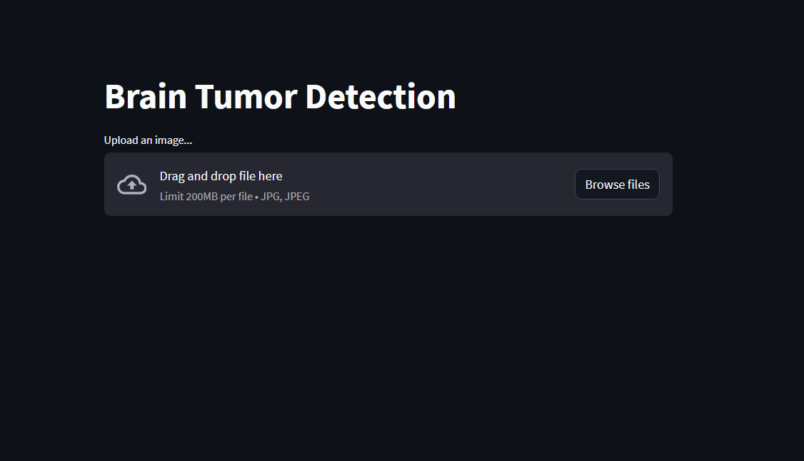
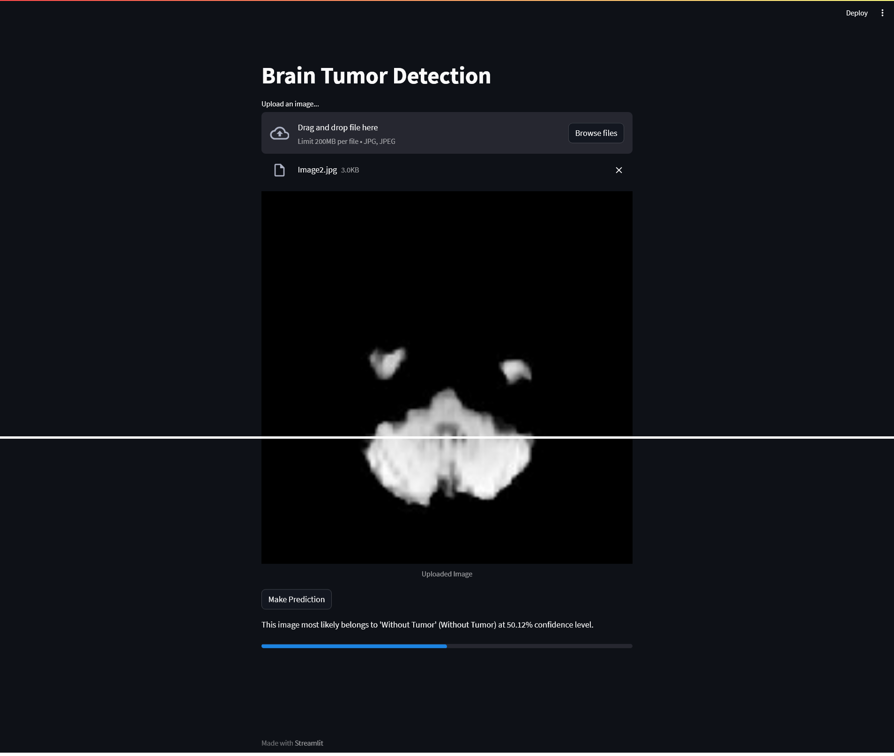

# Brain Tumor Detection from MRI Images

This project focuses on detecting brain tumors from MRI images using a deep learning model. The application combines advanced image preprocessing techniques and neural networks for accurate predictions. A user-friendly **Streamlit frontend** was also developed to make the system accessible for real-world applications.

---

## Features

- **Deep Learning Model**: Utilizes MobileNetV2 for image feature extraction and a Dense network for numerical data fusion, achieving a remarkable **95% accuracy**.
- **Grad-CAM Interpretability**: Implements Grad-CAM to provide visual explanations for model predictions.
- **Streamlit Frontend**: An interactive interface allowing users to upload MRI images and view tumor prediction results in real-time.
- **Preprocessing Techniques**: 
  - Histogram Equalization  
  - Image Resizing  
  - Noise Reduction  
  - Contrast Adjustment  

---

## Dataset

The model is trained on a curated dataset of MRI brain images, categorized into tumor and non-tumor classes. Data augmentation techniques were applied to ensure model generalization and robustness.

---

## Technologies Used

- **Backend**: Python, TensorFlow/Keras  
- **Frontend**: Streamlit  
- **Visualization**: Grad-CAM  

---

## Application Workflow

1. **Upload MRI Image**: Users upload an MRI image through the Streamlit interface.
2. **Prediction**: The model processes the image and predicts if a tumor is present.
3. **Explainability**: Grad-CAM highlights tumor-affected areas (if any) on the MRI image.

---

## How to Run

1. Clone the repository:
   ```bash
   git clone <repository-url>
   cd brain-tumor-detection
pip install -r requirements.txt
Launch the Streamlit app:

streamlit run app.py

Access the application in your browser at http://localhost:8501.
## 📷 Screenshots
Below are additional visuals from the dashboard:

### **Streamlit Frontend**


### **Results**


---

## 📝 Author
- Created by [Devesh Jaluka](https://github.com/dj216185)
